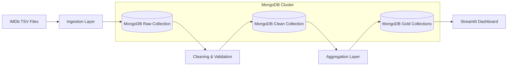

# 🎬 IMDb Big Data Analytics Platform

A full end-to-end **Big Data analytics pipeline** built on **MongoDB**, processing over **750,000 IMDb movie records**, with structured **Raw → Clean → Gold** layers and an interactive **Streamlit dashboard**.

---

## 📌 Project Overview

This project demonstrates how large-scale semi-structured data can be ingested, cleaned, validated, aggregated, and visualized using modern Big Data tools.

**Key highlights:**

* Distributed NoSQL database (MongoDB)
* Schema validation using Pydantic
* Layered data architecture
* Aggregated analytics (Gold layer)
* Interactive visualizations with Streamlit

---

## 🧠 Big Data Platform

**MongoDB** (NoSQL Distributed Database)

* Document-oriented
* Horizontally scalable
* Replica-set capable
* Suitable for semi-structured data at scale

---

## 📊 Dataset

**Source:** IMDb Official Datasets
**Format:** TSV (Tab-Separated Values)

| File                | Description     |
| ------------------- | --------------- |
| `title.basics.tsv`  | Movie metadata  |
| `title.ratings.tsv` | Ratings & votes |

**Volume:**

* ~750,000 movie records
* 8+ meaningful columns

---

## 🏗️ Architecture



---

## 🧩 Cluster Structure

* **Deployment Type:** Single-Node MongoDB
* **Replica Set Ready:** Yes
* **Sharding:** Not enabled (dataset fits single node)
* **Scalable:** Same architecture works on multi-node clusters

---

## 🗂️ Data Layers

| Layer | MongoDB Collection | Purpose                |
| ----- | ------------------ | ---------------------- |
| Raw   | `raw_data`         | Original IMDb records  |
| Clean | `clean_movies`     | Cleaned & validated    |
| Gold  | `movies_by_genre`  | Genre-level aggregates |
| Gold  | `movies_by_year`   | Year-wise trends       |
| Gold  | `top_movies`       | High-rating movies     |

---

## ⚙️ Tech Stack

* **Python 3.12**
* **MongoDB**
* **Pandas**
* **Pydantic**
* **Streamlit**
* **Docker (Optional)**
* **Loguru Logging**

---

## 📁 Project Structure

```
IMDb_Capstone/
│
├── data/
│   ├── title.basics.tsv
│   ├── title.ratings.tsv
│
├── src/
│   ├── config.py
│   ├── ingest.py
│   ├── clean.py
│   ├── aggregate.py
│   ├── models.py
│
├── streamlit_app.py
├── docker-compose.yml
├── README.md
```

---

## 🚀 Installation & Setup

### 1️⃣ Clone Repository

```bash
git clone https://github.com/your-username/IMDb_Capstone.git
cd IMDb_Capstone
```

### 2️⃣ Create Virtual Environment

```bash
python -m venv .venv
source .venv/bin/activate   # macOS/Linux
.venv\Scripts\activate      # Windows
```

### 3️⃣ Install Dependencies

```bash
pip install -r requirements.txt
```

---

## 🐳 MongoDB Setup (Docker – Recommended)

```bash
docker compose up -d
```

Initialize replica set:

```bash
docker exec -it imdb_mongo mongosh
```

```js
rs.initiate({
  _id: "rs0",
  members: [{ _id: 0, host: "localhost:27017" }]
})
```

---

## 🔄 Run Data Pipeline

### Ingest Raw Data

```bash
python -m src.ingest
```

### Clean & Validate

```bash
python -m src.clean
```

### Build Aggregations

```bash
python -m src.aggregate
```

---

## 📈 Streamlit Dashboard

```bash
streamlit run streamlit_app.py
```

### Visualizations:

* 🎭 Top Genres by Movie Count
* 📈 Movies Released Per Year
* ⭐ Top Rated Movies (Min 10K Votes)

---

## 📹 Presentation Video

🎥 **Unlisted YouTube Link:**
*(Add link here)*

**Covers:**

* Architecture
* MongoDB setup
* Data ingestion
* Cleaning & validation
* Aggregations
* Visualizations
* Learnings & insights

---

## 👤 Author

**Saraswathi Vallaikal**
---
**Mohana Thota**
---
Big Data Capstone Project


---


